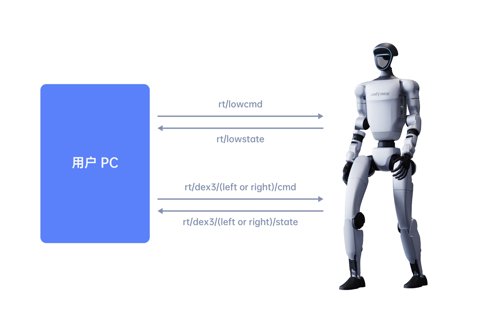
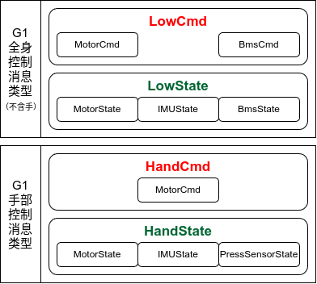

底层通信提供了用户端PC（PC2/外部 PC）与机器人之间的数据交互功能。底层通信采用 DDS 协议（**DDS相关知识可查阅**[《DDS通信接口》](https://support.unitree.com/home/zh/G1_developer/dds_services_interface))。


- 订阅话题 `rt/lowstate`(类型: `unitree_hg::msg::dds_::LowState_`) 获取 G1 当前状态。

- 发布话题 `rt/lowcmd`(类型: `unitree_hg::msg::dds_::LowCmd_`) 控制全身关节电机（不含灵巧手）、电池等设备。

- 若使用 Dex3-1 力控灵巧手，需发布话题 `rt/dex3/(left or right)/cmd`(类型: `unitree_hg::msg::dds_::HandCmd_`) 控制灵巧手，并从 `rt/dex3/(left or right)/state`(类型: `unitree_hg::msg::dds_::HandState_`) 话题接受灵巧手状态。


<p align="center">
  
</p>

# 接口说明

采用 [DDS通信接口](https://support.unitree.com/home/zh/G1_developer/dds_services_interface) 里介绍的方法订阅或发布话题。话题信息存储在由 IDL 定义的结构体中，常用结构体有：

| 结构体名称          | 说明       |
| ------------------- | --------------- |
| `HandCmd_`          | Dex3-1 控制     |
| `HandState_`        | Dex3-1 状态     |
| `IMUState_`         | G1 IMU 状态     |
| `LowCmd_`           | G1 底层控制     |
| `LowState_`         | G1 底层状态     |
| `MotorCmd_`         | G1 电机控制     |
| `MotorState_`       | G1 电机状态     |
| `PressSensorState_` | Dex3-1 触觉状态 |

# 消息类型介绍
## Dex3-1 控制

* `unitree_hg::msg::dds_::HandCmd_`

  ```c++
  struct HandCmd_ {
    sequence<unitree_hg::msg::dds_::MotorCmd_> motor_cmd;  // 灵巧手所有电机控制指令
  };
  ```
## Dex3-1 状态
* `unitree_hg::msg::dds_::HandState_`

  ```c++
  struct HandState_ {
    sequence<unitree_hg::msg::dds_::MotorState_>
      motor_state;                                         // 灵巧手所有电机状态
    unitree_hg::msg::dds_::IMUState_ imu_state;            // 灵巧手 IMU 状态
    sequence<unitree_hg::msg::dds_::PressSensorState_>
      press_sensor_state;                                  // 灵巧手压力传感器状态
    float power_v;                                         // 灵巧手电源电压
    float power_a;                                         // 灵巧手电源电流
    unsigned long reserve[2];                              // 保留
  };
  ```
## IMU 状态
* `unitree_hg::msg::dds_::IMUState_`

  ```c++
  struct IMUState_ {
    float quaternion[4];                                   // 四元数 QwQxQyQz
    float gyroscope[3];                                    // 陀螺仪(角速度) omega_xyz
    float accelerometer[3];                                // 加速度 acc_xyz
    float rpy[3];                                          // 欧拉角
    short temperature;                                     // IMU 温度
  };
  ```
## 底层控制 
* `unitree_hg::msg::dds_::LowCmd_`

  ```c++
  struct LowCmd_ {
    octet mode_pr;                                         // 并联机构（脚踝和腰部）控制模式 (默认 0) 0:PR, 1:AB
    octet mode_machine;                                    // G1 型号：4：23-Dof；5：29-Dof；6:27Dof(29Dof-锁腰)
    unitree_hg::msg::dds_::MotorCmd_ motor_cmd[35];        // 身体所有电机控制指令
    unsigned long reserve[4];                              // 保留
    unsigned long crc;                                     // 校验和
  };
  ```
## 底层状态
* `unitree_hg::msg::dds_::LowState_`

  ```c++
  struct LowState_ {
    unsigned long version[2];                              // 版本   
    octet mode_pr;                                         // 并联机构（脚踝和腰部）控制模式 (默认 0) 0:PR, 1:AB
    octet mode_machine;                                    // G1 型号
    unsigned long tick;                                    // 计时器 每1ms递增
    unitree_hg::msg::dds_::IMUState_ imu_state;            // IMU 状态
    unitree_hg::msg::dds_::MotorState_ motor_state[35];    // 身体所有电机状态
    octet wireless_remote[40];                             // 宇树实体遥控器原始数据
    unsigned long reserve[4];                              // 保留
    unsigned long crc;                                     // 校验和
  };
  ```
## 电机控制
* `unitree_hg::msg::dds_::MotorCmd_`

  ```c++
  struct MotorCmd_ {
    octet mode;                                            // 电机控制模式 0:Disable, 1:Enable
    float q;                                               // 关节目标位置
    float dq;                                              // 关节目标速度
    float tau;                                             // 关节前馈力矩
    float kp;                                              // 关节刚度系数
    float kd;                                              // 关节阻尼系数
    unsigned long reserve[3];                              // 保留
  };
  ```
## 电机状态
* `unitree_hg::msg::dds_::MotorState_`

  ```c++
  struct MotorState_ {
    octet mode;                                            // 电机当前模式
    float q;                                               // 关节反馈位置 (rad)
    float dq;                                              // 关节反馈速度 (rad/s)
    float ddq;                                             // 关节反馈加速度 (rad/s^2)
    float tau_est;                                         // 关节反馈力矩   
    float q_raw;                                           // 保留
    float dq_raw;                                          // 保留
    float ddq_raw;                                         // 保留
    short temperature[2];                                  // 电机温度 (外表与绕组温度)
    unsigned long sensor[2];                               // 传感器数据
    float vol;                                             // 电机端电压
    unsigned long motorstate;                              // 电机状态
    unsigned long reserve[4];                              // 保留
  };
  ```
## 触觉状态
* `unitree_hg::msg::dds_::PressSensorState_`

  ```c++
  struct PressSensorState_ {
    float pressure[12];
    float temperature[12];
  };
  ```

<!-- ### 消息依赖关系

<p align="center">
  
</p>

> 注意：消息依赖图中的消息类型省略了下划线`_`，实际代码里的消息类型都以下划线`_`结束。   -->


<!-- # 使用说明

- 订阅话题 `rt/lowstate`(类型: `unitree_hg::msg::dds_::LowState_`) 获取 G1 当前状态。

- 发布话题 `rt/lowcmd`(类型: `unitree_hg::msg::dds_::LowCmd_`) 控制全身关节电机（不含灵巧手）、电池等设备。

- 若使用 Dex3-1 力控灵巧手，需发布话题 `rt/dex3/(left or right)/cmd`(类型: `unitree_hg::msg::dds_::HandCmd_`) 控制灵巧手，并从 `rt/dex3/(left or right)/state`(类型: `unitree_hg::msg::dds_::HandState_`) 话题接受灵巧手状态。

 ## Dex3-1 关节电机顺序

`unitree_hg::msg::dds_::HandCmd_.motor_cmd` 与 `unitree_hg::msg::dds_::HandState_.motor_state` 包含所有的灵巧手电机的信息，其电机顺序如下：

| Hand Joint Index in IDL | Hand Joint Name |
| ----------------------- | --------------- |
| 0                       | thumb_0         |
| 1                       | thumb_1         |
| 2                       | thumb_2         |
| 3                       | index_0         |
| 4                       | index_1         |
| 5                       | middle_0        |
| 6                       | middle_1        |

## G1 全身关节电机顺序

`unitree_hg::msg::dds_::LowCmd_.motor_cmd` 与 `unitree_hg::msg::dds_::LowState_.motor_state` 包含 G1 全身电机（不含手）的信息，其电机顺序如下：

| Joint Index in IDL | Joint Name (LowCmd_.mode or LowState_.mode == 0) | Joint Name (LowCmd_.mode or LowState_.mode == 1) |
| ------------------ | ------------------------------------------------ | ------------------------------------------------ |
| 0                  | L_LEG_HIP_PITCH                                  | L_LEG_HIP_PITCH                                  |
| 1                  | L_LEG_HIP_ROLL                                   | L_LEG_HIP_ROLL                                   |
| 2                  | L_LEG_HIP_YAW                                    | L_LEG_HIP_YAW                                    |
| 3                  | L_LEG_KNEE                                       | L_LEG_KNEE                                       |
| 4                  | **L_LEG_ANKLE_PITCH**                            | **L_LEG_ANKLE_B**                                |
| 5                  | **L_LEG_ANKLE_ROLL**                             | **L_LEG_ANKLE_A**                                |
| 6                  | R_LEG_HIP_PITCH                                  | R_LEG_HIP_PITCH                                  |
| 7                  | R_LEG_HIP_ROLL                                   | R_LEG_HIP_ROLL                                   |
| 8                  | R_LEG_HIP_YAW                                    | R_LEG_HIP_YAW                                    |
| 9                  | R_LEG_KNEE                                       | R_LEG_KNEE                                       |
| 10                 | **R_LEG_ANKLE_PITCH**                            | **R_LEG_ANKLE_B**                                |
| 11                 | **R_LEG_ANKLE_ROLL**                             | **R_LEG_ANKLE_A**                                |
| 12                 | TORSO                                            | TORSO                                            |
| 13                 | L_SHOULDER_PITCH                                 | L_SHOULDER_PITCH                                 |
| 14                 | L_SHOULDER_ROLL                                  | L_SHOULDER_ROLL                                  |
| 15                 | L_SHOULDER_YAW                                   | L_SHOULDER_YAW                                   |
| 16                 | L_ELBOW_PITCH                                    | L_ELBOW_PITCH                                    |
| 17                 | L_ELBOW_ROLL                                     | L_ELBOW_ROLL                                     |
| 18                 | R_SHOULDER_PITCH                                 | R_SHOULDER_PITCH                                 |
| 19                 | R_SHOULDER_ROLL                                  | R_SHOULDER_ROLL                                  |
| 20                 | R_SHOULDER_YAW                                   | R_SHOULDER_YAW                                   |
| 21                 | R_ELBOW_PITCH                                    | R_ELBOW_PITCH                                    |
| 22                 | R_ELBOW_ROLL                                     | R_ELBOW_ROLL                                     |
 -->
