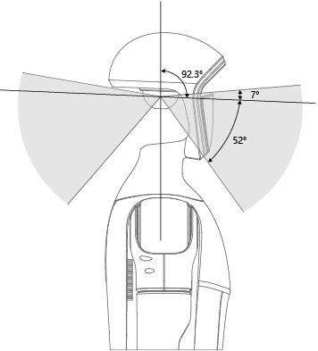

# 雷达服务接口

## 软件服务版本要求
Lidar Driver >= 1.0.0.5，若内置服务版本低，请联系技术支持升级至正确版本。

## 基本信息
Mid-360雷达位于G1机器人的头部中间，Mid-360内部的IMU与雷达的坐标关系`（0.011, 0.02329, -0.04412）`（单位：米），没有旋转变换的关系。可以用以下变换矩阵表示
$$
\begin{bmatrix}1 & 0 & 0 & 0.011\\ 0 & 1 & 0 & 0.02329 \\ 0 & 0 & 1 & -0.04412\\ 0 & 0 & 0 & 1 \end{bmatrix}
$$

<p align = "center">

  
Mid360雷达在G1上的安装方式如上图所示，其中，雷达坐标系相对于机器人坐标的位置关系`（-0.0, 0.0, -0.47618）`，采用倒置方式安装，Mid-360雷达pitch轴倾角是`-2.3`°（单位：度），yaw轴和roll轴无倾斜。

</p>

## 数据接口
发出的数据分别为点云和IMU的DDS格式数据；点云话题为`rt/utlidar/cloud_livox_mid360`，输出频率10HZ,frame_id为`"livox_frame"`;IMU话题为`rt/utlidar/imu_livox_mid360`，输出频率为200HZ。

## 订阅案例
```C++
#include <unitree/robot/channel/channel_subscriber.hpp>
#include <unitree/idl/ros2/PointCloud2_.hpp>
#include <unitree/idl/ros2/Imu_.hpp>

#define LIDAR_TOPIC "rt/utlidar/cloud_livox_mid360"
#define IMU_TOPIC "rt/utlidar/imu_livox_mid360"

using namespace unitree::robot;
using namespace unitree::common;

void LidarHandler(const void* msg)
{
    const sensor_msgs::msg::dds_::PointCloud2_* pc_data = (const sensor_msgs::msg::dds_::PointCloud2_*)msg;
    std::cout << "Lidar data received" << std::endl;
}

void ImuHandler(const void* msg)
{
    const sensor_msgs::msg::dds_::Imu_* imu_data = (const sensor_msgs::msg::dds_::Imu_*)msg;
    std::cout << "Imu data received" << std::endl;
}

int main()
{
    ChannelFactory::Instance()->Init(0);
  

    ChannelSubscriberPtr<sensor_msgs::msg::dds_::PointCloud2_> lidar_sub_ = ChannelSubscriberPtr<sensor_msgs::msg::dds_::PointCloud2_>(new ChannelSubscriber<sensor_msgs::msg::dds_::PointCloud2_>(LIDAR_TOPIC));
    ChannelSubscriberPtr<sensor_msgs::msg::dds_::Imu_> imu_sub_ = ChannelSubscriberPtr<sensor_msgs::msg::dds_::Imu_>(new ChannelSubscriber<sensor_msgs::msg::dds_::Imu_>(IMU_TOPIC));


    lidar_sub_->InitChannel(std::bind(LidarHandler, std::placeholders::_1), 1);
    imu_sub_->InitChannel(std::bind(ImuHandler, std::placeholders::_1), 1);


    while (true)
    {
        sleep(10);
    }

    return 0;
}
```
