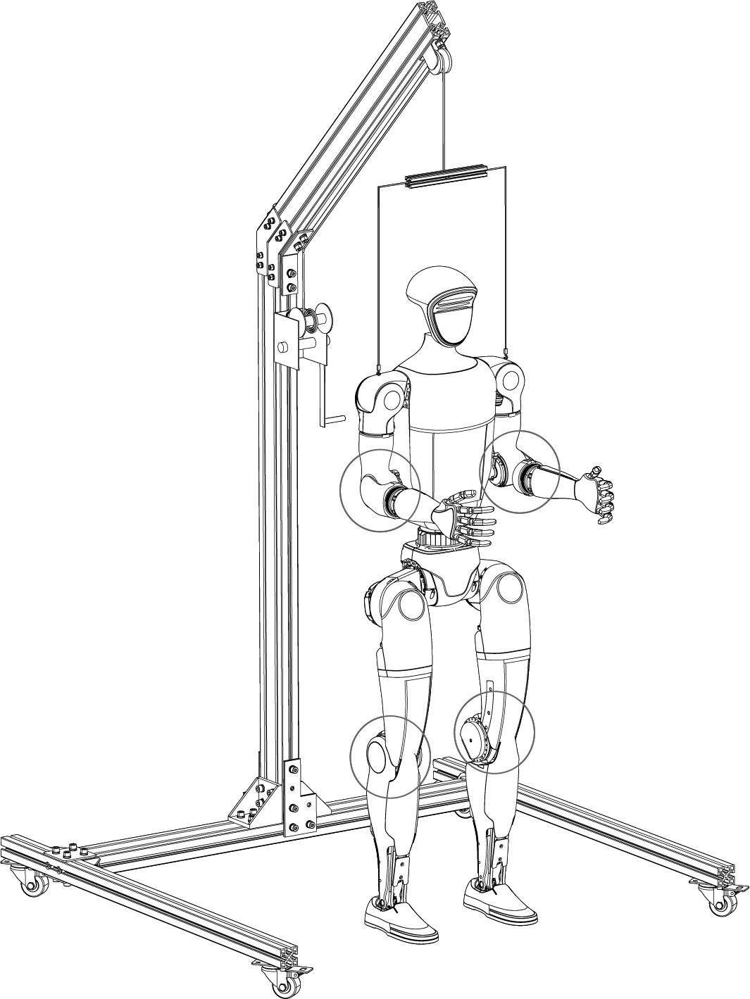
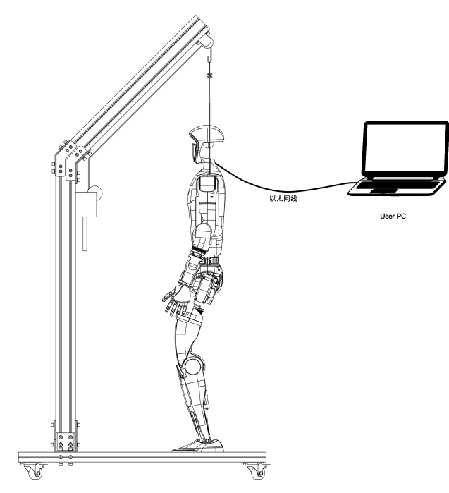

您可以使用自己的 PC（**Ubuntu系统**）通过网线连接 G1 机身肩部的以太网口，来建立 User PC 和 G1 之间的通讯。您的程序既可以部署再自己 PC 上，也可以部署在 G1 自带的二次开发板上，通过 DDS 网络控制 G1 运动。 

Step 1:将 G1 固定在保护支架上，确保支架底部四个万向轮锁死。

Step 2: User PC 通过以太网线，跟设备的RJ45口连接, 详见[《关于G1》](https://support.unitree.com/home/zh/G1_developer/about_G1)章节中的的电气接口介绍，即可进行通信调试。

<!-- 这段内容不会被显示 

-->
